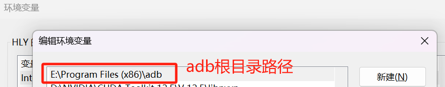
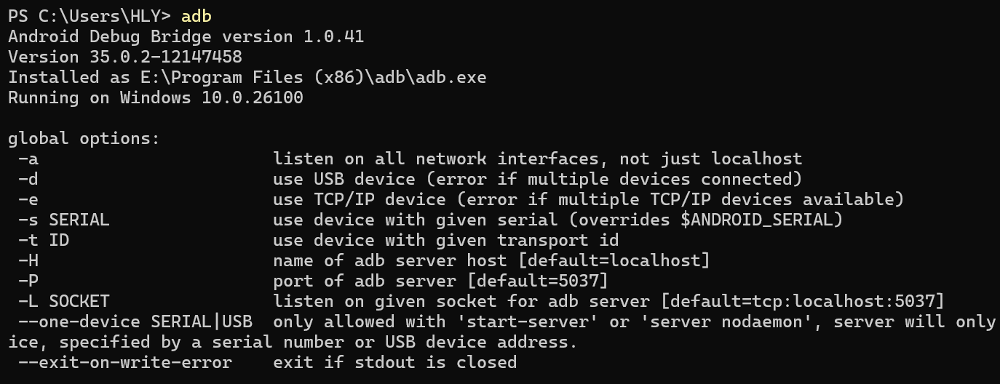

## 🚀 Project Overview 📱

A Python-based automated content publishing system that configures tasks via Excel to automatically publish content and images to the Xiaohongshu platform. Supports multi-device management, scheduled publishing, and file monitoring.


🌐 Multi-language Support: [简体中文](README.md) | English | [繁體中文](README.zh-TW.md)

## 🛠️ Technology Stack

- **🐍 Python 3.x**: Core language
- **📊 pandas**: Data processing & Excel operations
- **📱 uiautomator2**: Android device automation
- **🔍 watchdog**: File system monitoring
- **🧵 threading**: Multi-threading
- **📦 poetry**: Dependency management
- **📝 logging**: Logging system

## 🌟 Core Features

**📋 Excel Task Management**

- ✅ Automatic Excel file change monitoring
- 🔄 Multi-task concurrent processing
- 📅 Real-time task status updates

**📂 File System Monitoring**

- 📁 Real-time resource monitoring
- 📦 Automatic directory structure creation
- 🖼️ JPG/PNG/MP4 format support

**📱 Device Management**

- 🔌 Real-time device status monitoring
- 📲 ADB file transfer
- 🔃 Auto-reconnection mechanism

**🚀 Automated Publishing**

- 🔓 Automatic device unlock
- 🤖 UI element recognition
- 📸 Mixed media publishing support

**⏰ Task Scheduling**

- ⏰ Scheduled task execution
- 🚦 Task queue management
- ❗ Exception handling

## 📂 Project Structure

```bash
project_root/
├── config/                 # Configuration
│   ├── settings.py        # Main config
│   └── ignore_config.py   # Log filters
├── core/                  # Core modules
│   ├── excel_monitor.py   # Excel monitoring
│   ├── file_handler.py    # File processing
│   ├── task_scheduler.py  # Task scheduling
│   └── android_automation.py # Android automation
├── utils/                 # Utilities
│   ├── adb_utils.py      # ADB tools
│   ├── excel_utils.py    # Excel tools
│   ├── logger.py         # Logging
│   └── content_reader.py # Content reader
├── uploads/              # Uploads directory
├── logs/                 # Logs
├── temp/                 # Temp files
└── main.py              # Entry point
```

## ⚙️ Workflow

**1️⃣ Initialization**

- Load configurations
- Initialize logging
- Create directories
- Start file monitoring

**2️⃣ Task Processing**

```
Excel change -> Data validation -> Create task dir -> Wait for resources -> File transfer -> Update status -> Add to queue -> Execute publishing
```

**3️⃣ Publishing Process**

```
Connect device -> Unlock -> Launch app -> Select album -> Choose media -> Input text -> Publish -> Update status
```

## 📦 Installation

**🖥️ Requirements**

- Python 3.9.0
- ADB tools
- Android device (USB debugging enabled)

**🛠️ Setup**

```bash
1️⃣ Clone master branch
git clone -b master https://github.com/xlj-hly/Company_AAP_demo1.git

2️⃣ Create virtual env
python -m venv .venv

3️⃣ Activate env
.\.venv\Scripts\activate

4️⃣ Install poetry
pip3 install poetry

5️⃣ Install dependencies
poetry install
```

**📲 ADB Configuration**

- Extract ADB package
- Configure ADB environment variables:
  
- Test connection:
  

**⚠️ Configuration**

- Set device info in `config/settings.py`
- Configure tasks in Excel
- Ensure proper device connection

**🚀 Launch System**

```bash
python main.py
```

## ⚠️ Important Notes

📊 Excel must include `time` and `postName` columns
📁 Store images in uploads/{task_name}/ directory
📶 Maintain stable network connection
📝 Regularly check logs for system status

## 🚨 Error Handling

🚨 File operation exceptions
📲 Device connection retries
📊 Task status tracking
📝 Detailed error logging

## 📊 Log Management

📉 Multi-level logging
📊 Module-specific log files
📅 Configurable log filters
📊 Automatic log rotation
